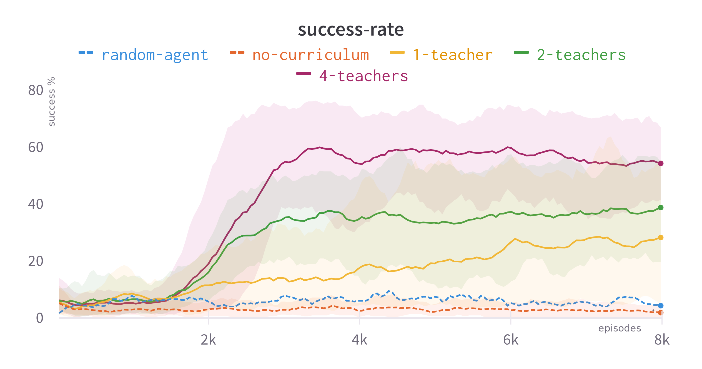

# Implementation of Multi-Teacher Curriculum Design Using Traces using Cogment


### Setup, Build and Run

1. Install cogment 2.2.0
2. Clone this repository
3. Install `parallel`, on ubuntu it is installable using `apt-get install parallel`, on mac it is available through `brew install parallel`
4. Install `unrar`, on ubuntu it is installable using `apt-get install unrar`, on mac it is available through `brew install unrar`
5. `./run.sh build`
6. `./run.sh services_start`
7. In a different terminal, start the Multi agent asymmetric selfplay trial with `sudo ./run.sh client start selfplay_td3_driving`.
8. You can change the parameters for the run in `run_params.yaml`
sample `run_params` for 2 teachers:
```yaml
selfplay_td3_driving: &default_selfplay_td3_params
  implementation: selfplay_td3_training
  config: &default_elfplay_td3_config
    class_name: data_pb2.SelfPlayTD3TrainingRunConfig
    environment:
      specs:
        implementation: driving/SimpleDriving-v0
        num_players: 3
      config:
        seed: 12
        render_width: 1000
        framestack: 4
    actor:
      implementation: selfplay_td3
      config:
        num_input: 7
        num_input_2: 2
        num_action: 2
        action_scale: [ 0.5,0.6 ]
        action_bias: [ 1.0,0.0 ]
        max_action: 1
        alice_grid_shape: [75, 75, 2]
        bob_grid_shape: [75, 75, 3]
        actor_network:
          hidden_size: 64
        critic_network:
          hidden_size: 64
        model_kwargs:
          start_timesteps: 5000
          high_action: [ 0, -1 ]
          low_action: [ 1, 1 ]
          expl_noise: 0.1
    rollout:
      epoch_count: 1000
      epoch_train_trial_count: 1
      epoch_test_trial_count: 20
      max_parallel_trials: 1
      model_publication_interval: 10
      number_turns_per_trial: 5
      test_freq: 50
    training:
      num_teachers: 2
      rollout_multiplier: 1
      batch_size: 64
      discount_factor: 0.99
      tau: 0.005
      policy_noise: 0.1
      noise_clip: 0.2
      learning_rate: 3e-4
      policy_freq: 2
      SIGMA: 0.2
      num_training_steps: 2
      beta: 0.05
      alice_reward: 5.0
      bob_reward: 5.0
      alice_penalty: -5.0
      bob_penalty: 0
    replaybuffer:
      min_replay_buffer_size: 256
      max_replay_buffer_size: 5000
      replay_buffer_config:
        observation_dtype: float32
        action_dtype: float32
```
Based on this, you will also have to change the default number of agents in `environment/pybullet_driving.py` to `num_teacher + 1`.

The eun generates `.npy` files for success rate and adversarial rewards in the `torch_agents` directory. Once the run completes, the results can be visualised using matplotlib as:
```python
import numpy as np
import matplotlib.pyplot as plt

success = np.load("success.npy")
plt.plot(success)
plt.show()
```

